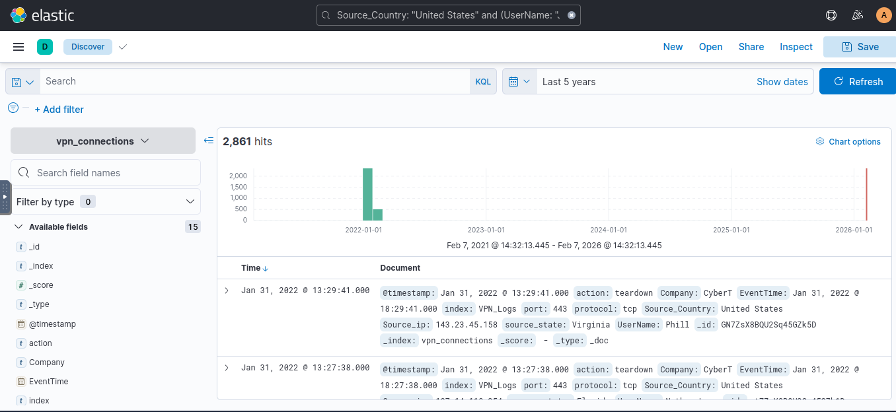

# Elastic SIEM Threat Investigation

This repository documents my hands-on learning experience using the Elastic Stack (ELK) for security monitoring and threat investigation.

## Platform

TryHackMe

## Module

Investigating with Elastic Stack

## Skills Developed

- Log analysis using Elastic Stack
- Security event investigation
- VPN connection log analysis
- Threat investigation techniques
- Use of Kibana Discover
- Event filtering using KQL (Kibana Query Language)
- Time-based event analysis
- Identifying suspicious IP activity

## Practical Investigation Tasks

- Investigated VPN connection logs
- Identified peak connection activity
- Filtered logs by IP address, user, and country
- Applied time filters for incident investigation
- Used KQL queries to correlate events
- Simulated real-world SOC analyst workflow

## Tools Used

- Elastic Stack (ELK)
- Kibana Discover
- Kibana Query Language (KQL)



## Example Query Used

```kql
Source_Country: "United States" and (UserName: "James" or UserName: "Albert")


